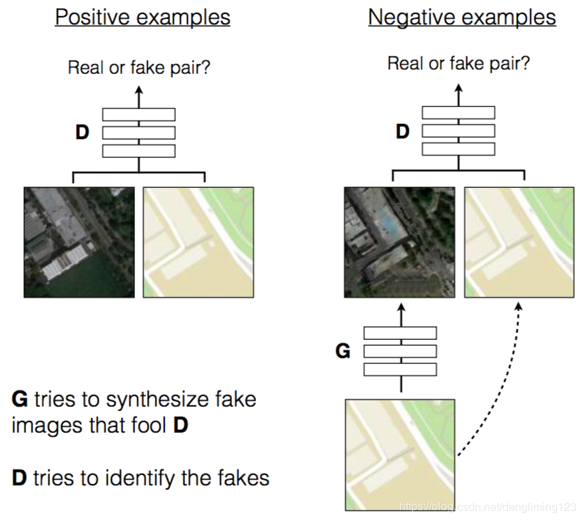

# pix2pix
Teamproject pix2pix Group 2. 
Team members: Daniel, Jialu, Lasse 
Project duration: 26.Juni.2020 - 26.Juli.2020 

# Documentation 
#### 02.07.2020 
We created our pix2pix repository.

#### 07.07.2020 
We had our first discussion and learned more about pix2pix.

#### 12.07.2020 
The structure of our code will be like : 
  - Install 
  - Dataset 
  - Load 
  - Randomize 
  - Training 
  - Testing 
  
  We added discriminator and generator in models.py 

## Tutorial on how to run the pix2pix in Colab 
1.Open the Notebook in Google Colab with the following link:  
 
2.In order to run the whole pix2pix-code,go under 'Run all' over the dropdown menu 'Runtime'. 

## Overview 
The Pix2Pix Generative Adversarial Network(GAN) is a framework based on adversarial neural network, which can realize image-to-image translation.The goal of image-to-image translation tasks is to output images that based on the input images(soruce images),such as converting maps to satellite photographs, black and white photographs to color, and sketches of products to product photographs. 

### Specific process  
Since it's based on the GAN framework,we need to frist define the input and output. The input of Generator(G) received by ordinary GAN is a random vector, and the output is an image; the input received by Discriminator(D) is an image (generated or real), and the output is real or fake. This way G and D can work together to output real images. 
But for the image-to-image translation tasks, its G input should obviously be a picture x, and the output is of course a picture y. However, some changes should be made to the input of D, because in addition to generating a real image, it is also necessary to ensure that the generated image and the input image match.In this case,the input of D has beed changed to a loss function. 

## Explanation of code 
###   

## Summary 

### Output 
